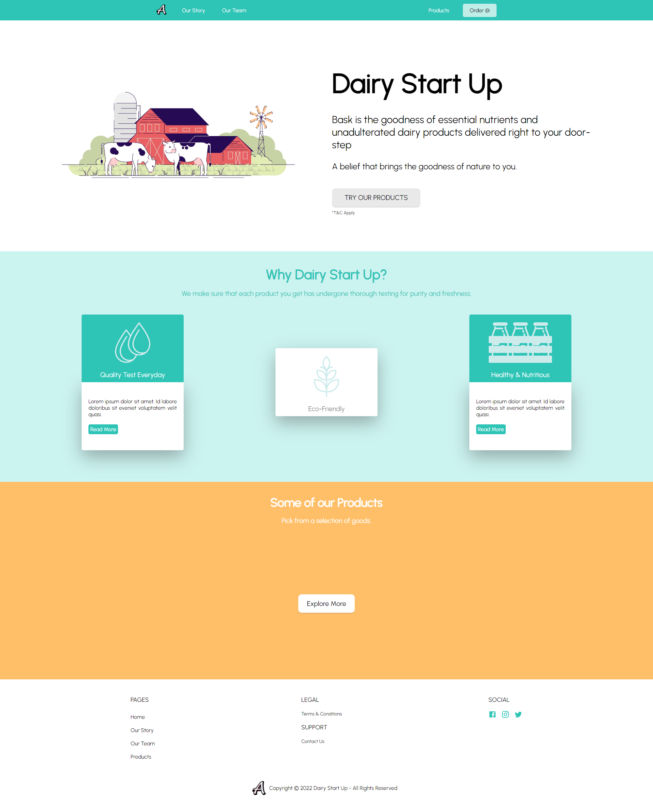

# Dairy Start Up Website Template

 <!-- Add a GIF or screenshot of your app here -->

## Table of Contents

- [Description](#description)
- [Features](#features)
- [Technologies Used](#technologies-used)
- [Setup and Installation](#setup-and-installation)
- [Template Link](#template-link)

## Description

This is a responsive dairy farm website using React and Material-UI, featuring a basic design and ensuring a seamless user experience across various devices, including desktops and mobile platforms.

## Features

- User Experience: The application is designed to have a clean user experience.
- Responsive Design: The application is designed to work on various screen sizes.

## Technologies Used

- **React**: A JavaScript library for building the user interface.
- **SCSS**: Styling is done using SCSS and can be further customized.
- **Material UI**: An open-source React component library that implements Google's Material Design.

## Setup and Installation

1. Clone this repository to your local machine:

   ```bash
   git clone https://github.com/ScarAlcatraz/dairy-startUp-website-template.git
   

2. Navigate to the project directory:

   ```bash
   cd dairy-startUp-website-template

3. Once inside `dairy-startUp-website-template` directory and install server dependencies:

   ```bash
   npm install

## Template Link

- Link to the template website: https://dairy-start-up.netlify.app
